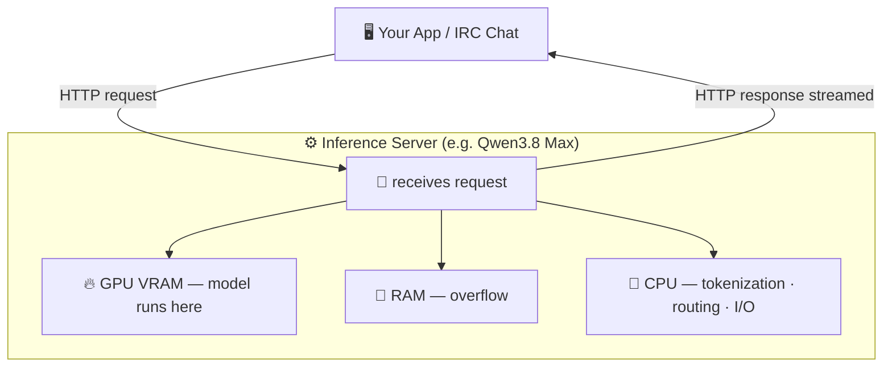
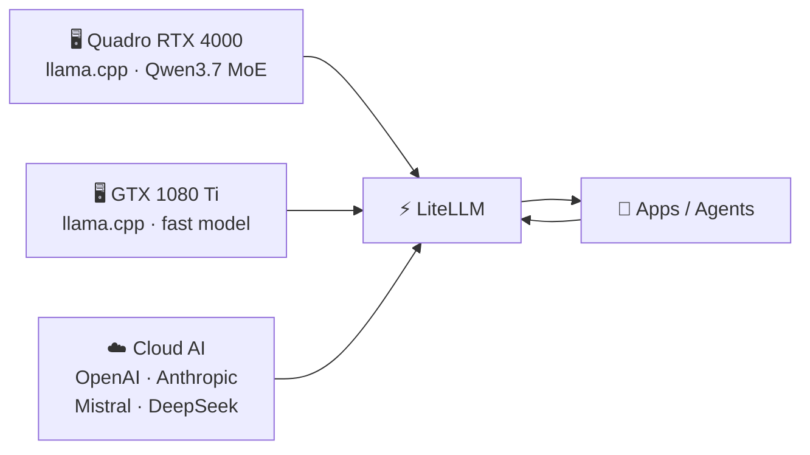

# Do.It.Yourself [AI]
## Running your own AI inference server

*NZ Tech Expo 2026*

---

# Chat with our AI — right now

📱

[ QR CODE ]

*Running on our own hardware. No ChatGPT. No OpenAI.*

> Scan now and start chatting — I'll explain what's happening under the hood while you do.

 

*Powered by a mix of technologies spanning **38 years** — IRC (1988) meets local AI inference (2026).*

---

# What is AI?
## It depends who you ask.

| | Who | What they say |
|---|---|---|
| 👔 | A CEO | "A productivity multiplier for my team" |
| 👨‍⚕️ | A doctor | "A tool that helps me diagnose faster" |
| 🔬 | A researcher | "Statistical pattern matching on massive datasets" |
| 🖥️ | A DevOps engineer | "An API I can self-host and plug into my pipeline" |
| 👨‍💻 | A developer | "A process I can call and add into my other processes" |

 

**They're all right.**

*But today we're talking about running it yourself.*

---

# AI is a 5-Layer Cake
*— Jensen Huang, NVIDIA · [blogs.nvidia.com](https://blogs.nvidia.com/blog/ai-5-layer-cake/)*

  

    
🛠️ APPLICATIONS

    
IRC bots · AI agents · coding assistants · chat apps · your own tools

    
👈 WE BUILD HERE

  

  

    
🧠 MODELS

    
Llama 3 · Qwen · DeepSeek · Mistral · Phi · Gemma · open weights

    
👈 WE CHOOSE HERE

  

  

    
⚙️ INFRASTRUCTURE

    
GPU server · llama.cpp · LiteLLM · OpenAI-compatible API

    
👈 WE RUN HERE

  

  

    
💾 CHIPS

    
NVIDIA · AMD · Apple Silicon

    

  

  

    
⚡ ENERGY

    
power · cooling

    

  

> "Every successful application pulls on every layer beneath it — all the way down to the power plant."

Big tech is spending **trillions** building this stack. You can join the **top three layers** for the cost of a **second-hand GPU**.

---

# For a developer, AI is a process

---

# Hardware? Less than you think.

> 💡 *"The best hardware is what you have immediately available without spending any money"*

**What fits where:**

| Size | Model | VRAM | Runs on |
|---|---|---|---|
| XXS | Qwen2.5-0.5B | ~300 MB | Phone, Raspberry Pi |
| XS | Phi-4-mini | ~2 GB | Any laptop, CPU-only |
| M | Llama 3.1 8B | ~5 GB | Gaming GPU |
| L | Qwen3.7 MoE | ~20 GB | 2× Quadro RTX 4000 👈 us |
| XL | Qwen3 32B | ~24 GB | RTX 4090 / 3090 |
| XXL | Qwen3.8 Max | ~40 GB | Multi-GPU server |

Source: <a href="https://benchlm.ai">benchlm.ai</a> · best open weight · Aug 15, 2026

- **VRAM** is the bottleneck — fit the model in for full speed
- RAM offload works but is 10–20× slower
- CPU handles tokenization + routing + I/O

**What we actually run:**

- **Primary**: Qwen3.7 MoE · 22B active
- **Router**: LiteLLM — OpenAI-compatible API
- **Fallback**: Groq / DeepSeek if both busy

---

# What does owning the infrastructure give you?

  

    
🔒

    
Privacy

    
Your data never leaves the building

    <ul class="hero-bullets">
      <li>Prompts stay on your network</li>
      <li>No vendor logging your queries</li>
      <li>GDPR / compliance friendly</li>
    </ul>
  

  

    
💸

    
Cost

    
Pay once — not per token, forever

    <ul class="hero-bullets">
      <li>Break-even in weeks vs. API</li>
      <li>Unlimited calls, zero surprise bills</li>
    </ul>
  

  

    
⚡

    
Control

    
You decide everything

    <ul class="hero-bullets">
      <li>Swap models in seconds</li>
      <li>No rate limits or outages</li>
      <li>Fine-tune on your own data</li>
    </ul>
  

  Cloud AI charges per token — <strong>every word, every character, every call.</strong> 
  Local inference only costs <strong>electricity.</strong>

---

# Scan. Chat. Ask us anything.

📱

[ QR CODE ]

*The agent you're talking to is running on our hardware — right now.*

 

**[your contact / site]**
